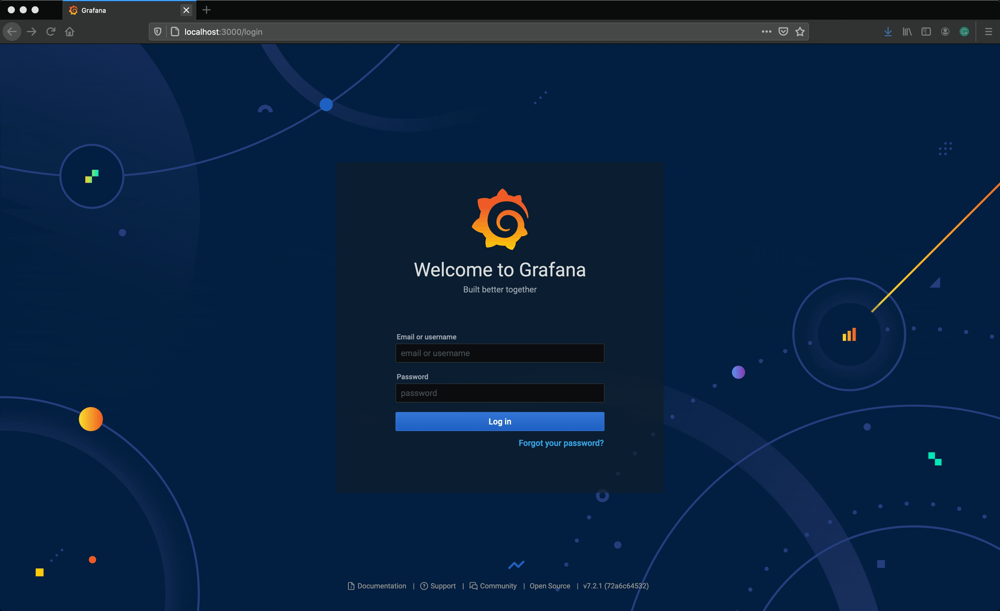

# Step 6: Metrics

In this step, we will add a logging platform and forward our application logs to it. 

## Goals

* Install Prometheus
* Install Grafana
* Modify application configuration so that prometheus could scrape metrics
* Look at app metrics in Grafana

## Tasks

### Create a namespace for metrics components

```bash
$ kubectl create ns metrics
namespace/metrics created
```

### Install Prometheus using the Helm chart

```bash
helm repo add prometheus-community https://prometheus-community.github.io/helm-charts
helm repo add stable https://kubernetes-charts.storage.googleapis.com/
helm install prometheus prometheus-community/prometheus -n metrics --create-namespace
```

Make sure everything is running:

```bash
$ kubectl get pods -n metrics
NAME                                            READY   STATUS    RESTARTS   AGE
prometheus-alertmanager-64bf78d458-bv86m        2/2     Running   0          87s
prometheus-kube-state-metrics-95d956569-4zkc8   1/1     Running   0          87s
prometheus-node-exporter-vjjss                  1/1     Running   0          87s
prometheus-pushgateway-69ccbfb9b8-sz822         1/1     Running   0          87s
prometheus-server-bc989b599-6rdrz               2/2     Running   0          87s
```

### Install Grafana usisng the Helm chart

```bash
helm repo add grafana https://grafana.github.io/helm-charts
helm install grafana grafana/grafana -n metrics
```

Note the password in the output of `helm install` above.
You will need to it to login to Grafana.

### Add Prometheus datasource to Grafana

First, port-forward Grafana service so we can reach it locally.

```bash
$ kubectl port-forward -n metrics svc/grafana 3000:80
Forwarding from 127.0.0.1:3000 -> 3000
Forwarding from [::1]:3000 -> 3000
```

Note the service name of the Prometheus server (it should be `prometheus-server`):

```bash
$ kubectl get svc -n metrics
NAME                            TYPE        CLUSTER-IP      EXTERNAL-IP   PORT(S)    AGE
grafana                         ClusterIP   10.96.174.225   <none>        80/TCP     110s
prometheus-alertmanager         ClusterIP   10.96.183.194   <none>        80/TCP     3m52s
prometheus-kube-state-metrics   ClusterIP   10.96.181.90    <none>        8080/TCP   3m52s
prometheus-node-exporter        ClusterIP   None            <none>        9100/TCP   3m52s
prometheus-pushgateway          ClusterIP   10.96.134.255   <none>        9091/TCP   3m52s
prometheus-server               ClusterIP   10.96.210.0     <none>        80/TCP     3m52s
```

Next, go to `http://localhost:3000` in your browser
and add Prometheus as the datasource as shown below.
Once added, we should be able to see Kubernetes metrics.



### Scrape metrics from the api service

First, enable the metrics endpoint on the `api` service
by setting `METRICS_ENABLE_PROMETHEUS` to `true` in the deployment.yaml.

```yaml
env:
  - name: METRICS_ENABLE_PROMETHEUS
    value: "true"
```

Next, to scrape metrics, provide Prometheus pod annotations:

```yaml
annotations:
  prometheus.io/scrape: "true"
  prometheus.io/path: /metrics
  prometheus.io/port: "80"
```

The resulting `deployment.yaml` will look like this:

```yaml
apiVersion: apps/v1
kind: Deployment
metadata:
  name: api
  labels:
    app: api
spec:
  replicas: 1
  selector:
    matchLabels:
      app: api
  template:
    metadata:
      labels:
        app: api
      annotations:
        prometheus.io/scrape: "true"
        prometheus.io/path: /metrics
        prometheus.io/port: "80"
    spec:
      containers:
        - name: api
          image: docker.io/lkysow/api:v0.1.0
          env:
            - name: METRICS_ENABLE_PROMETHEUS
              value: "true"
          ports:
            - containerPort: 80
```

Next, apply this configuration to the cluster:

```bash
$ kubectl apply -f deployment.yaml
deployment.apps/api configured
```

Verify that we can see app metrics now.
Go back to the Grafana UI and run the following query to see response time
for the 95th percentile:

```
histogram_quantile(0.95, sum(rate(handle_request_http_seconds_bucket[1h])) by (le))
```


## Conclusion

We can now see our application metrics in Grafana through Prometheus.

## Next Step

Go to [7-migration](../7-migration/README.md).